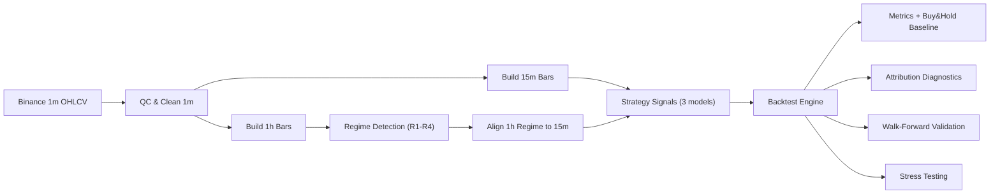

# BTCUSDT Regime Multi-Strategy Trading

A regime-aware BTCUSDT trading system built from raw market data to reproducible evaluation outputs.

## At A Glance

- Market: `BTCUSDT` on `binance_spot` (UTC)
- Source data: `1m` OHLCV only
- Derived bars: `15m`, `1h`
- Regimes: `R1-R4` (Trend/Range x HighVol/LowVol)
- Strategies: Donchian, EMA-ADX, Mean Reversion
- Backtest window: `2022-01-01` to `2025-12-31`

## Contents

- [Project Goals](#project-goals)
- [Pipeline Overview](#pipeline-overview)
- [Regime And Strategy Logic](#regime-and-strategy-logic)
- [Results Snapshot](#results-snapshot)
- [Quick Start](#quick-start)
- [Repository Structure](#repository-structure)
- [Reproducibility](#reproducibility)
- [Limitations](#limitations)

## Project Goals

- Build a transparent and reproducible regime-based trading workflow.
- Keep the stack interpretable and auditable.
- Enforce anti-lookahead alignment between regime labels and strategy bars.
- Evaluate both return and risk with diagnostics, walk-forward, and stress tests.

## Pipeline Overview



## Regime And Strategy Logic

### Regime definitions (1h)

| Regime | Definition |
|---|---|
| `R1` | Trend + LowVol |
| `R2` | Trend + HighVol |
| `R3` | Range + LowVol |
| `R4` | Range + HighVol |

### Allocation policy

| Regime | Donchian | EMA-ADX | Mean Reversion |
|---|---:|---:|---:|
| `R1` | 0.6 | 0.4 | 0.0 |
| `R2` | 0.4 | 0.4 | 0.0 |
| `R3` | 0.0 | 0.0 | 1.0 |
| `R4` | 0.0 | 0.0 | 0.0 |

### Execution constraints (default)

- Long-only spot mode
- Minimum holding bars: `168` (15m bars)
- Rebalance threshold: `0.2`
- Regime smoothing: `min_regime_run_bars = 3`

## Results Snapshot

Configuration:
- Symbol: `BTCUSDT`
- Period: `2022-01-01` to `2025-12-31` (UTC)
- Backtest rows: `140,256` (15m)
- Costs: fee `4 bps`, slippage `1 bps`, position lag `1` bar

### Full-period backtest vs buy-and-hold

| Metric | Strategy | Buy & Hold |
|---|---:|---:|
| Total Return | 68.80% | 89.07% |
| Annual Return | 13.97% | 17.25% |
| Sharpe | **0.588** | 0.566 |
| Max Drawdown | **-29.67%** | -67.48% |

Summary:
- Lower raw return than buy-and-hold in this window.
- Better drawdown control and slightly higher Sharpe.

### Walk-forward (aggregate OOS)

- Folds: `2` (non-overlapping test windows)
- OOS total return: `31.75%`
- OOS Sharpe: `0.642`
- OOS max drawdown: `-28.79%`
- OOS buy-and-hold total return: `107.58%`

### Stress test

- Scenario count: `10`
- Dimensions: fee, slippage, execution lag, volatility shock, combined worst case
- Worst total-return scenario: `fee_12`
- Worst drawdown scenario: `combined_worst_case`

## Quick Start

### 1) Environment

```bash
python3 -m venv .venv
source .venv/bin/activate
pip install --upgrade pip
pip install -e '.[dev]'
```

### 2) Run full pipeline

```bash
PYTHONPATH=src python -m bt_regime_system.cli fetch-1m --config configs/default.yaml
PYTHONPATH=src python -m bt_regime_system.cli qc-1m --input-path data/raw_1m --config configs/default.yaml
PYTHONPATH=src python -m bt_regime_system.cli build-bars --input-path data/clean_1m --config configs/default.yaml
PYTHONPATH=src python -m bt_regime_system.cli qc-bars --config configs/default.yaml
PYTHONPATH=src python -m bt_regime_system.cli detect-regime --config configs/default.yaml
PYTHONPATH=src python -m bt_regime_system.cli align-regime --config configs/default.yaml
PYTHONPATH=src python -m bt_regime_system.cli qc-regime --config configs/default.yaml
PYTHONPATH=src python -m bt_regime_system.cli plot-regime --config configs/default.yaml
PYTHONPATH=src python -m bt_regime_system.cli generate-signals --config configs/default.yaml
PYTHONPATH=src python -m bt_regime_system.cli run-backtest --config configs/default.yaml
PYTHONPATH=src python -m bt_regime_system.cli diagnose-backtest --config configs/default.yaml
PYTHONPATH=src python -m bt_regime_system.cli walk-forward --config configs/default.yaml
PYTHONPATH=src python -m bt_regime_system.cli stress-backtest --config configs/default.yaml
```

### 3) Run tests

```bash
PYTHONPATH=src pytest -q
```

## Repository Structure

```text
configs/                 # default parameters + data contracts
src/bt_regime_system/    # core package (data/regime/strategies/signals/backtest/analysis)
tests/                   # unit and integration tests
data/                    # raw/clean/bars and QC reports (gitignored artifacts)
results/                 # signals/regime/backtest/metrics outputs (gitignored artifacts)
notebooks/               # evaluation notebook
docs/                    # reproducibility and operational docs
```

## Reproducibility

- Full run/reproducibility protocol: `docs/RUN_REPRO_SPEC.md`
- Core runtime config: `configs/default.yaml`
- Data/schema contract: `configs/data_contract.yaml`

## Limitations

- Single asset (`BTCUSDT`) and single venue (`binance_spot`).
- Strategy family is intentionally simple and interpretable.
- No portfolio-level optimization or cross-asset risk budgeting.

## Disclaimer

This repository is for research and engineering purposes only, not investment advice.
